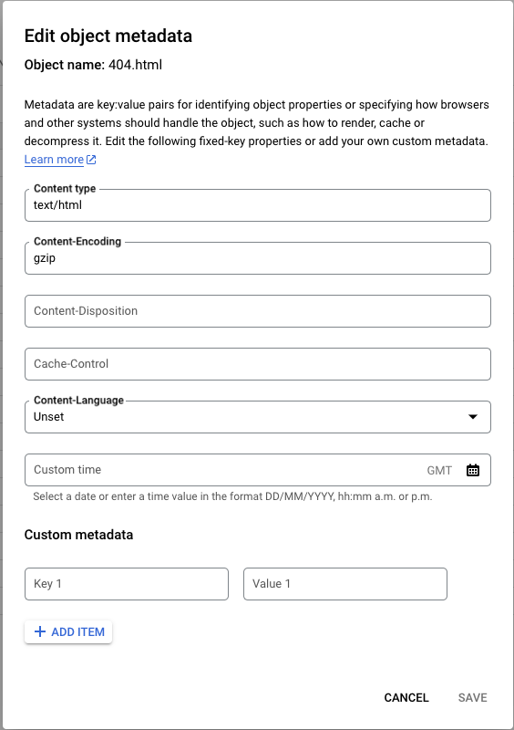

# GCS Webserver Quick Start


<!-- TOC -->
* [GCS Webserver Quick Start](#gcs-webserver-quick-start)
  * [Assumptions made](#assumptions-made)
  * [Things we do not set up](#things-we-do-not-set-up)
  * [Terraform](#terraform)
  * [Kubernetes](#kubernetes)
  * [Troubleshooting issues](#troubleshooting-issues)
    * [Pod won't start](#pod-wont-start)
    * [404 errors, or objects not found](#404-errors-or-objects-not-found)
    * [Page loads blank](#page-loads-blank)
      * [How to check](#how-to-check)
      * [How to fix this](#how-to-fix-this)
        * [GitHub Actions](#github-actions)
<!-- TOC -->

This page is designed to help you get up and running quickly.

If you are familiar with [Terraform](https://terraform.io) and [Kubernetes](https://kubernetes.io) and want to skip the 
full instructions, the `TL;DR` is:

1. Edit terraform vars and set project
2. Apply
3. Copy output name of Service account in to `kubernetes/serviceaccount.yaml`
4. Apply

If you are not confident, follow the below.

## Assumptions made

1. You are not changing the name of the `gcs` bucket
2. You are using the `default` kubernetes namespace

## Things we do not set up

* Service
* Ingress

This is on you, as everyone does their ingress and service different. 

## Terraform

We are using terraform to provision the infrastructure for the GCS bucket, IAM etc.

As mentioned in the main [README](../README.md#what-you-need-pre-existing) - You need a GKE cluster with workload identity enabled.

1. cd to `terraform` (`cd example/terraform`)
2. Edit the `terraform.tfvars` file
3. Change the `project=` to the name of your project. 
4. Ensure that Google cloud CLI is logged in to your account (`gcloud auth application-default login`)
5. Run `terraform init`
6. Run `terraform plan`
7. If all looks okay, run `terraform apply`

Copy and paste the email address that is printed. We need this for the Kubernetes step.

## Kubernetes

You will need to have already logged in and authenticate to your GKE cluster.

1. cd to `kubernetes` (`cd example/kubernetes`)
2. Edit the `serviceaccount.yaml` file
3. Paste the email address from the terraform output in to the value for `iam.gke.io/gcp-service-account` 
4. run `kubectl apply -f .`


## Troubleshooting issues

A good port of call for any whack issues, is to check the GCS Fuse documentation.

Useful pages are below

* [Playbook for Production issues](https://github.com/GoogleCloudPlatform/gcsfuse/blob/master/docs/playbook.md)
* [Mounting](https://github.com/GoogleCloudPlatform/gcsfuse/blob/master/docs/mounting.md)
* [Semantics](https://github.com/GoogleCloudPlatform/gcsfuse/blob/master/docs/semantics.md)
* [GCS Fuse Issues](https://github.com/GoogleCloudPlatform/gcsfuse/issues?q=is%3Aissue)

### Pod won't start

If you are using a `VPC Native` cluster, and don't have `nat` set up, you won't be able to pull the image.

Consider copying the image to Google Artifact Registry [using GCrane](https://documentation.breadnet.co.uk/kb/docker/copy-containers-between-repos)

I plan to set up a `Google Artifact Registry` for images at some point.

### 404 errors, or objects not found

Use `gcsfuse` in a session on the pod and mount it to temp with debug, and try open a file. 

```shell
gcsfuse --foreground --debug_fuse --debug_fs --debug_gcs --debug_http  --implicit-dirs -o allow_other gcs-website /tmp/dir
```

Then navigate to `/tmp/dir` in another session and try open a file.

### Page loads blank

Ensure that objects copied to the bucket aren't being `gzipped` on the way.

#### How to check

Navigate to the GCS bucket where the pages are stored.

Click on the 3 dots on the far right hand side.

Click `Edit Metadata`

If you see `Content-Encoding` set to anything but blank (See example below) - Then it won't load.



#### How to fix this

##### GitHub Actions

```yaml
      - name: Upload Files
        id: 'upload-folder'
        uses: 'google-github-actions/upload-cloud-storage@v1'
        with:
          path: 'site'
          destination: 'gcs-website'
          parent: false
          gzip: false
```
